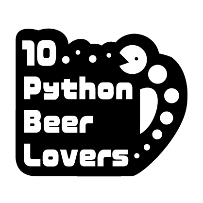
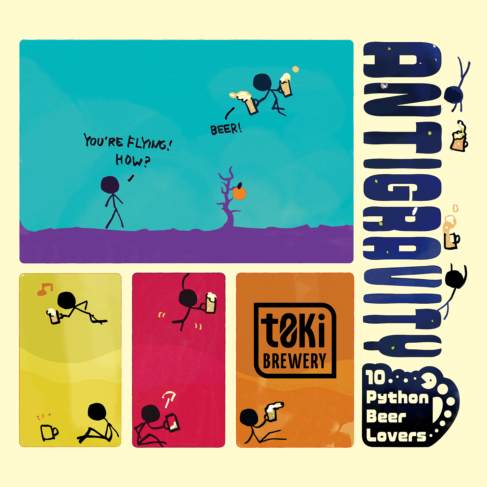

# 10 Python Beer Lovers



Pythonを愛し、ビールを愛し、そして飲んで楽しいことが大好きな人たちが、美味しいビールと共にみんなで楽しい場を作りたいと思って集まった有志たちです。

We are a group of volunteers who love Python, love beer and love to drink and have fun, and we came together to create a fun place for everyone with good beer.

## Special Beer: Antigravity(反重力)

「このビールを飲むと気持ちよくなって飛んじゃうよ」という気持ちを込めて名付けました。

We named the beer with the feeling that "this beer will make you feel good and flying".

```bash
$ python3
>>> import antigravity
```



## 出資者 / Investors

* 辻 真吾 / Shingo Tsuji
* 寺田 学 / Manabu Terada ([@terpayon](https://x.com/terapyon))
* 鈴木 たかのり / Takanori Suzuki ([@takanory](https://twitter.com/takanory))
* aodag
* 大﨑 有依 / Yui Osaki
* 橘 祐一郎 / Yuichiro Tachibana ([@whitphx](https://x.com/whitphx); 👉[Profile](https://www.whitphx.info/))
* 清水川 貴之 / Takayuki Shimizukawa
* 加藤 公一 / Kimikazu Kato
* 神沢 雄大 / Yuta Kanzawa
* 中神 肇 / Hajime Nakagami

## Special Thanks

* [t0ki brewery – トキブルワリー](https://t0ki.beer/)
